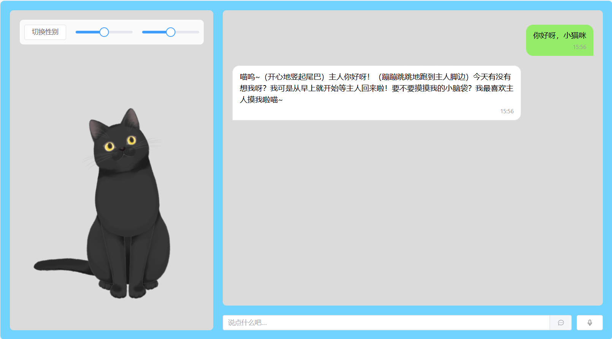
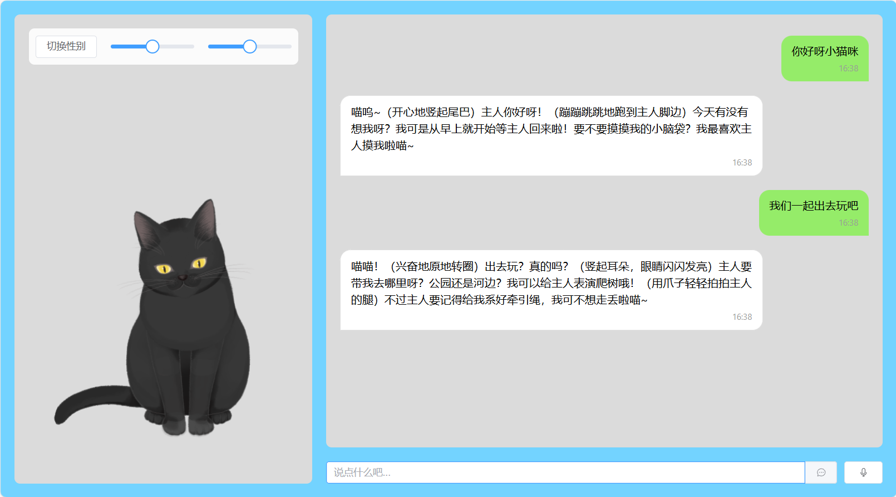
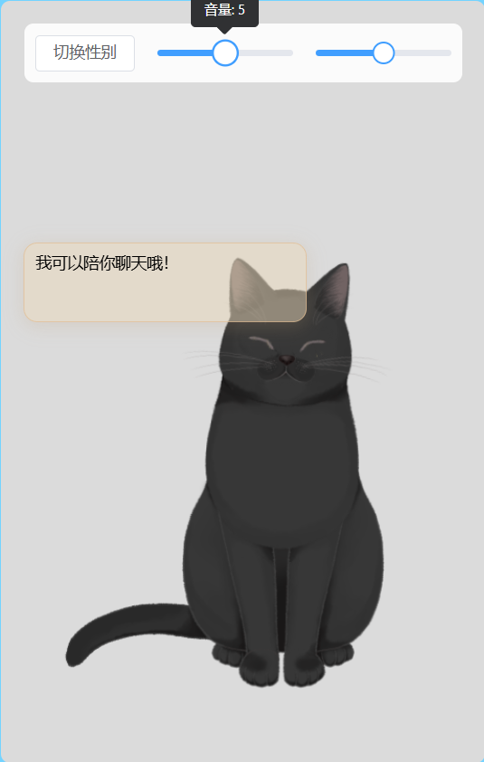
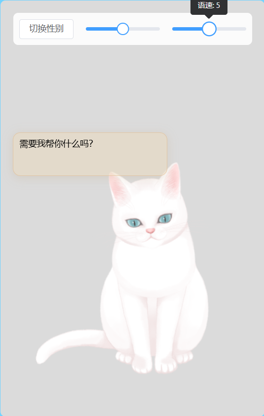
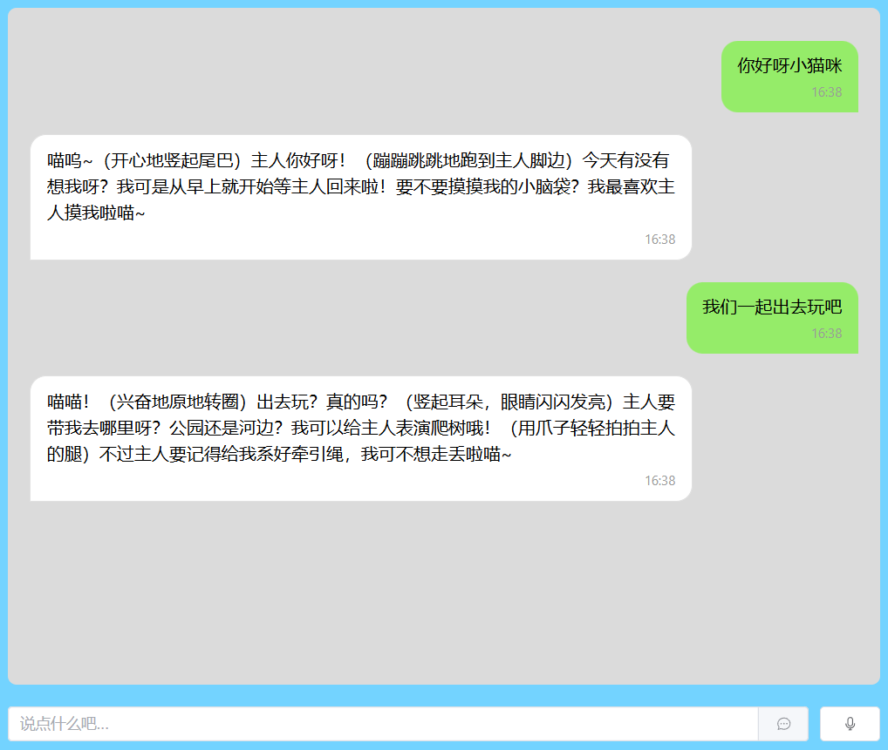

# 猫咪聊天机器人 (Cat Chat)

一个基于 Vue 3 + TypeScript 开发的智能猫咪聊天机器人，集成了 Live2D 模型展示、语音交互等功能。

## 功能特点

- 🐱 可爱的 Live2D 猫咪模型展示
- 🔄 支持黑猫和白猫切换
- 💬 智能对话系统
- 🎤 语音识别功能
- 🔊 文字转语音功能
- ⚙️ 可调节语音速度和音量
- 📱 响应式设计，支持移动端

## 技术栈

### 前端
- Vue 3
- TypeScript
- Element Plus
- Pinia 状态管理
- Live2D SDK

### 后端
- Node.js
- Express
- OpenAI API (DeepSeek)
- 语音服务 API

## 快速开始

### 环境要求
- Node.js >= 18.0.0
- npm >= 8.0.0

### 安装步骤

1. 克隆仓库
git clone <repository-url>
cd cat-chat

2. 安装前端依赖
<<<<<<< HEAD
```bash
=======
>>>>>>> 2a55676 (first commit)
cd speaken-frontend
npm install

3. 安装后端依赖
<<<<<<< HEAD
```bash
=======
>>>>>>> 2a55676 (first commit)
cd ../speaken-backend
npm install

4. 配置环境变量
<<<<<<< HEAD
```bash

=======
>>>>>>> 2a55676 (first commit)
PORT=5000
NODE_ENV=development

# DeepSeek API配置
DEEPSEEK_API_KEY=your_api_key
DEEPSEEK_BASE_URL=your_api_url

# 百度语音API配置
BAIDU_APP_ID=your_app_id
BAIDU_API_KEY=your_api_key
BAIDU_SECRET_KEY=your_secret_key

# 百度语音合成配置
BAIDU_TTS_APP_ID=your_tts_app_id
BAIDU_TTS_API_KEY=your_tts_api_key
BAIDU_TTS_SECRET_KEY=your_tts_secret_key

5. 启动服务

前端开发服务器：
cd speaken-fronted
npm run dev

后端开发服务器：
cd speaken-backend
npm run dev

项目结构

cat-chat/
├── speaken-frontend/        # 前端项目
│   ├── src/
│   │   ├── components/     # 组件
│   │   ├── stores/        # Pinia 状态管理
│   │   ├── views/         # 页面
│   │   └── ...
│   └── public/
│       └── live2d/        # Live2D 模型资源
└── speaken-backend/        # 后端项目
    └── src/
        ├── controllers/   # 控制器
        ├── services/      # 服务层
        └── types/        # 类型定义

## 使用说明
1. 切换猫咪：点击"切换性别"按钮可以在黑猫和白猫之间切换
2. 语音设置：
   - 使用滑块调节语音音量（0-10）
   - 使用滑块调节语音速度（1-9）
3. 对话方式：
   - 文字输入：直接在输入框输入文字并发送
   - 语音输入：点击麦克风图标进行语音输入
## Live2D 模型说明
本项目使用的是 Live2D 官方样本模型 とろろ ひじき PRO版：

- 白猫「とろろ」
- 黑猫「ひじき」
模型支持多种互动动作，包括耳朵清理和舔手等特色动作。

## 致谢
- Live2D Inc. 提供的猫咪模型

## 📸 项目预览





